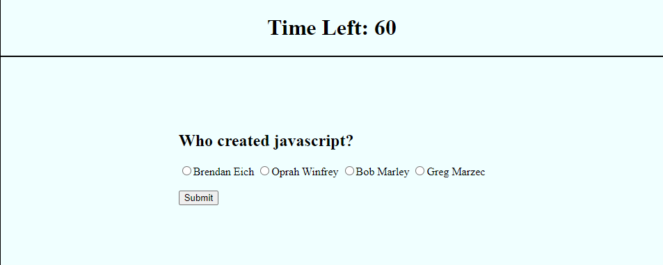

# web-api-quiz

## Project Description

This application is a mock test that was made to guage where i am with my understanding of web API's and DOM elements. It was made with javascript by me(Greg Marzec).

## Tools Used

* HTML
* CSS
* Javascript

## Link

[https://gregmarz.github.io/web-api-quiz/](https://gregmarz.github.io/web-api-quiz/)

## Example

## sources used

* [https://stackoverflow.com/questions/34084048/creating-a-multiple-choice-option-in-javascript](https://stackoverflow.com/questions/34084048/creating-a-multiple-choice-option-in-javascript)

* [https://stackoverflow.com/questions/60914905/save-value-of-input-in-local-storage](https://stackoverflow.com/questions/60914905/save-value-of-input-in-local-storage)
